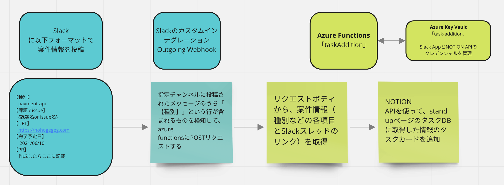

# 概要
特定のSlackチャンネルで指定フォーマットでタスク投稿すると、NOTIONにタスク情報を追加するプログラム（azure function）



# 開発方法
- azure functionsの環境構築（vscodeだと楽）を行い、func host start で起動
- ngrok http 7071を実行
- slack app directoryのOutgoing WebHooksのページに行き、URL欄に{ngrokのURL}/api/taskAdditionを設定
- タスク投稿時に作成されたNOTIONリンクがSlackチャンネルに届きます。また、NOTIONにはSlackスレッドのリンクが貼られますので、相互に遷移可能です

# 投稿例

```
【種別】
　payment-api
【課題 / issue】
　220602_株式会社hoge複製ボット開発依頼
【URL】
　https://wevnal.backlog.jp/view/hogehoge
【完了予定日】
　2022/06/08
```